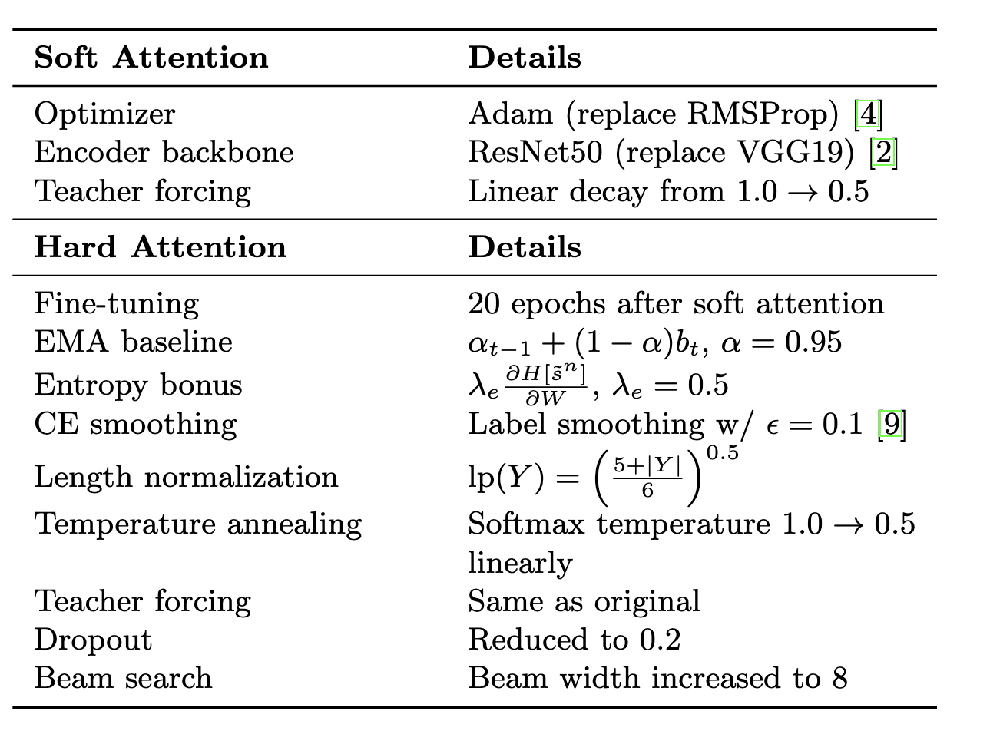
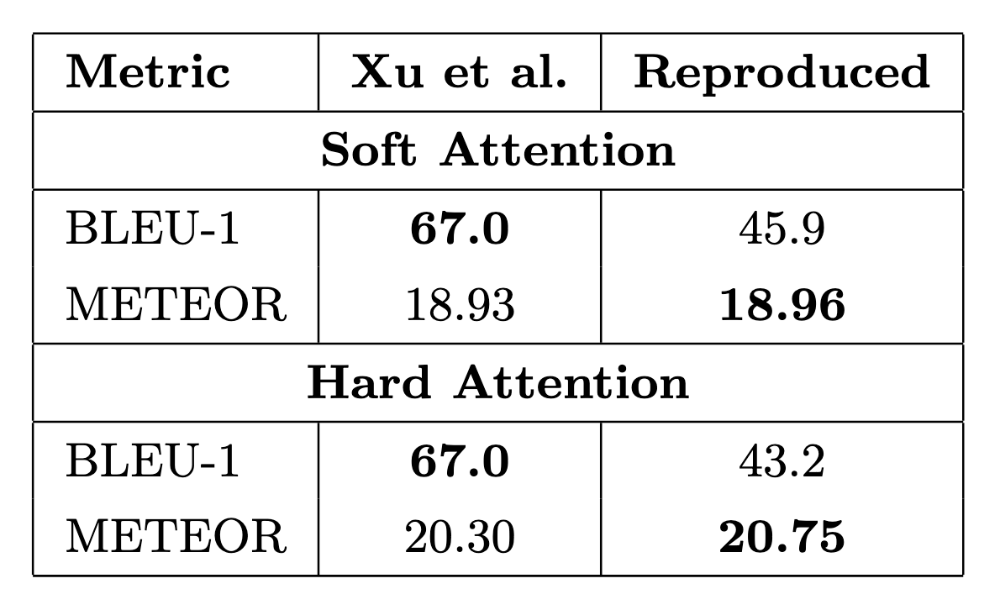

# Exploring Show, Attend, Tell Attention Mechanisms for Image Captioning
Nick Brenner, Alex Kozik, Brandon Li, Jake Silver, Srivatsa Kundurthy
## Introduction
****
Image captioning explores the space defined by the intersection of Natural Language Processing (NLP) and Computer Vision (CV). Generating a caption given an image, especially in zero-shot cases, is a difficult task due to the need for semantic alignment between two very different spaces and the inherent subjectivity in what is of importance in an image.


The present paper directly iterates on the approach given by Vinyal's et. al 2015 by introducing an attention mechanism to this CNN-RNN paradigm, hence the name **Show Attend Tell**. In addition to the traditional $h_{t-1}$, $y_t$ inputs to the LSTM gates, a context vector $z_t$ is computed using one of the proposed attention variants and is concatenated as an additional input at timestep $t$. In turn, the decoder RNN is able to learn where it should "look" in order to generate the $t$'th caption word. This dynamic attention mechanism helps mitigate the bottlenecking problem of RNN architectures, achieving state-of-the-art BLEU and METEOR scores in 2016, while also providing for increased interpretability.

## Chosen Result
We reproduce the METEOR scores for both soft and hard attention models on Flickr8k, focusing on this metric because it provides more semantically faithful evaluation than BLEU by accounting for linguistic variations. Given our compute constraints, Flickr8k was the optimal dataset to assess the robustness and reproducibility of these techniques under modern training & architectural regimes.

| **Model**        | **B-1** | **B-2** | **B-3** | **B-4** | **METEOR** |
|------------------|---------|---------|---------|---------|------------|
| Soft-Attention   | 67      | 44.8    | 29.9    | 19.5    | 18.93      |
| Hard-Attention   | 67      | 45.7    | 31.4    | 21.3    | 20.30      |

Table: Performance comparison of attention mechanisms on Flickr8k in the original paper [Xu et al., 2015]

## GitHub Contents 

Explanations of each of the different files used in the project:

- `run_sat.ipynb` - Python notebook which user can interact with to train, test, and visualize the results of our model. It interacts with both the code and data directories.

 
### Code Directory
- `datasets.py` - Vocabulary, Flickr8kDataset, collate_fn, LengthBasedBatchSampler, helpers
- `models.py` - Neural architectures: EncoderCNN, Attention, DecoderRNN, ShowAttendTell
- `training.py` - Training / evaluation routines, checkpoints, metric helpers
- `visualize.py` - Utilities for finding samples and plotting attention maps

### Data Directory
- `kaggle_cache/versions/2/Flickr8kDataset` - Contains the Flickr8k image dataset used for training and testing
- `nltk_data/` - Contains NLTK resources including:
  - `corpora/` - Natural language corpora for text processing
  - `tokenizers/` - Text tokenization resources

## Implementation Details


We implemented an encoder-decoder framework using a ResNet-50 encoder to produce 14×14×512 image feature maps and an LSTM decoder that generates captions, enhanced by attention mechanisms to dynamically focus on different regions of the image. Soft attention computes a weighted sum over all features, while doubly stochastic attention adds a regularization term to encourage all regions to be attended over time, and hard attention stochastically samples a single feature at each step using REINFORCE due to its non-differentiability. We trained on the Flickr8k dataset using standard splits and evaluated with BLEU-1 and METEOR metrics. Soft attention was optimized with Adam and backpropagation, while hard attention required additional techniques like EMA baselines, entropy regularization, and label smoothing to stabilize training. To accelerate convergence, we applied length-based mini-batching, and for hard attention, we fine-tuned the pretrained soft attention model for 20 extra epochs using REINFORCE. Key training adjustments included linear teacher forcing decay, dropout reduction, beam width expansion, and temperature annealing, resulting in stable soft attention training and reasonably effective hard attention fine-tuning.


## Reproduction Steps

1. Clone this repository.

2. Create a virtual environment and install the required packages:
   ```bash
   python -m venv venv
   source venv/bin/activate
   pip install -r requirements.txt
   ```

3. Open the notebook. It is organized into clearly labeled sections.

4. Run each section sequentially to reproduce the results.

## Running the Notebook

The notebook `run_sat.ipynb` is organized into 6 main sections:

1. **Setup (00-setup)**: Initializes the project environment, sets up paths, and configures NLTK data directories
2. **Imports (01-imports)**: Imports necessary modules and sets up the device (CPU/GPU)
3. **Data (02-data)**: Downloads and prepares the Flickr8k dataset, sets up data transformations
4. **Model (03-model)**: Initializes the ShowAttendTell model with specified parameters
5. **Train (04-train)**: Handles the model training and evaluation process
6. **Visualize (05-visualize)**: Generates sample captions and creates attention visualization plots

Each section is clearly labeled with comments and can be run sequentially to reproduce the results.

We ran the notebook on Google Colab using a T4 GPU, which took approximately 24 hours to complete.

## Example Outputs

After completing training, the visualization section will output where our model is attending and its caption attempts. An example is included below:


## Results/Insights



Despite lacking access to the original paper’s hyperparameters and optimization details, our models achieved higher METEOR scores on Flickr8k—improving by +0.03 for soft attention and +0.45 for hard attention—demonstrating the robustness and replicability of the original approach. While BLEU-1 scores were lower, likely due to unknown tokenization methods which BLEU heavily depends on, our strong METEOR results validate the success of our reimplementation. Due to the absence of several published training details, we made heuristic choices and trained under single-GPU constraints. Importantly, our approach also enhances interpretability by allowing visualization of the model’s attention through heat maps, offering insight into both correct and incorrect captioning decisions.


## Conclusion

Our reimplementation of Show, Attend, and Tell successfully reproduced and improved upon the original paper's results, achieving higher METEOR scores and using modern architectural choices like ResNet50, ADAM, and REINFORCE.


## References

[1] Michael Denkowski and Alon Lavie. "Meteor universal: Language specific translation evaluation for any target language." In *Proceedings of the Ninth Workshop on Statistical Machine Translation*, pages 376–380, 2014.

[2] Kaiming He, Xiangyu Zhang, Shaoqing Ren, and Jian Sun. "Deep residual learning for image recognition." In *Proceedings of the IEEE Conference on Computer Vision and Pattern Recognition*, pages 770–778, 2016.

[3] Micah Hodosh, Peter Young, and Julia Hockenmaier. "Flickr8k dataset." University of Illinois at Urbana-Champaign, 2013.

[4] Diederik P Kingma and Jimmy Ba. "Adam: A method for stochastic optimization." arXiv preprint arXiv:1412.6980, 2014.

[5] Kishore Papineni, Salim Roukos, Todd Ward, and Wei-Jing Zhu. "Bleu: a method for automatic evaluation of machine translation." *Proceedings of the 40th Annual Meeting of the Association for Computational Linguistics*, pages 311–318, 2002.

[6] Razvan Pascanu, Caglar Gulcehre, Kyunghyun Cho, and Yoshua Bengio. "How to construct deep recurrent neural networks." *Proceedings of the Second International Conference on Learning Representations*, 2014.

[7] Rita Ramos, Desmond Elliott, and Bruno Martins. "Retrieval-augmented transformer for image captioning." In *Proceedings of the 2022 ACM International Conference on Multimedia Retrieval*, pages 123–131. ACM, 2022.

[8] Rita Ramos, Desmond Elliott, and Bruno Martins. "Retrieval-augmented image captioning." In *Proceedings of the 17th Conference of the European Chapter of the Association for Computational Linguistics*, pages 3666–3681. Association for Computational Linguistics, 2023.

[9] Olga Russakovsky, Jia Deng, Hao Su, Jonathan Krause, Sanjeev Satheesh, Sean Ma, Zhiheng Huang, Andrej Karpathy, Aditya Khosla, Michael Bernstein, Alexander C Berg, and Li Fei-Fei. "Imagenet large scale visual recognition challenge." *International Journal of Computer Vision*, 115(3):211–252, 2015.

[10] Karen Simonyan and Andrew Zisserman. "Very deep convolutional networks for large-scale image recognition." arXiv preprint arXiv:1409.1556, 2014.

[11] Christian Szegedy, Vincent Vanhoucke, Sergey Ioffe, Jon Shlens, and Zbigniew Wojna. "Rethinking the inception architecture for computer vision." *Proceedings of the IEEE Conference on Computer Vision and Pattern Recognition*, pages 2818–2826, 2016.

[12] Oriol Vinyals, Alexander Toshev, Samy Bengio, and Dumitru Erhan. "Show and tell: A neural image caption generator." In *Proceedings of the IEEE Conference on Computer Vision and Pattern Recognition*, pages 3156–3164, 2015.

[13] Kelvin Xu, Jimmy Ba, Ryan Kiros, Kyunghyun Cho, Aaron Courville, Ruslan Salakhudinov, Rich Zemel, and Yoshua Bengio. "Show, attend and tell: Neural image caption generation with visual attention." *International Conference on Machine Learning*, pages 2048–2057, 2015.

[14] Shizhuo Dylan Zhang, Curt Tigges, Zory Zhang, Stella Biderman, Maxim Raginsky, and Talia Ringer. "Transformer-based models are not yet perfect at learning to emulate structural recursion." *Transactions on Machine Learning Research*, 2024.

[15] Wei Zhang and Jing Zhang. "TPCap: Unlocking zero-shot image captioning with trigger-augmented and multi-modal purification modules." arXiv preprint arXiv:2502.11024, 2025.

[16] "Framing Image Description as a Ranking Task: Data, Models and Evaluation Metrics", Journal of Artifical Intellegence Research, Volume 47, pages 853-899 http://www.jair.org/papers/paper3994.html

[17] Hannah Li, Sivaraman K S. "Show, Attend, and Tell Neural Image Caption Generation with Visual Attention". Slides

[18] Halfling Wizard. (2021). "Show, Attend And Tell - Paper Explained." YouTube. https://www.youtube.com/watch?v=y1S3Ri7myMg

## Acknowledgements

This project was completed as part of the Cornell CS4782: [Introduction to Deep Learning [SP25] course](https://www.cs.cornell.edu/courses/cs4782/2025sp/). We express our gratitude to the professors and course staff for compute allocations, as well as their sustained advising and feedback.

We would also like to thank the authors of the original papers for their groundbreaking work in attention-based image captioning. 

Most importantly, we would like to wish our moms a happy Mother's Day!